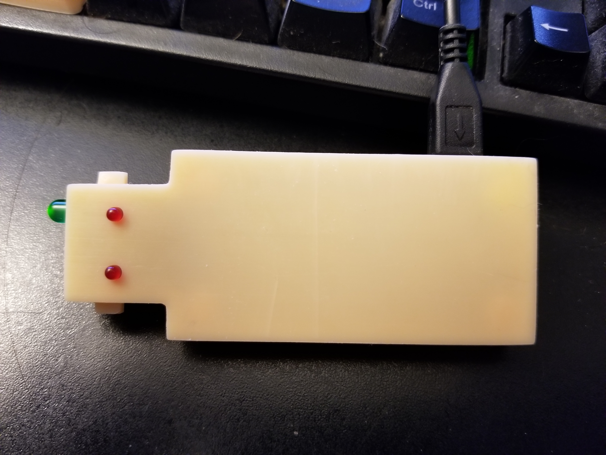

### Botty-5000



* [How to configure Botty response commands](response_commands.md)
* [How to set Botty up as a service on Raspberry Pi Zeros](raspberrypi_zero_service.md)
* [How to wire up Botty's Face](gerber/README.md)
* [How to print Botty's Body](stls/README.md)

To run Botty-5000, run the `botty.sh` file after installing dependencies. You will need to create 2 files.

* props.json
* chat_responses.json

## props.json
props.json is a file you need to create so Botty-5000 can interact with Discord.
Props.json has three possible properties right now

* bot-chat-trigger - When you talk to botty it needs to start with this string
* bot-command-prefix - All commands for Botty must start with this string
* bot-key - Discord bot key that gives Botty-5000 access to your channel
* log-level - How much Botty logs things out to `BottyLog.log` go here for info [Botty Logging](#Botty-Logging)
* pi-zero-leds - Turns on LED features for Botty

##### example
```
{
  "bot-chat-trigger": "Hey Botty",
  "bot-command-prefix": "Botty-",
  "bot-key": "123456789123456",
  "log-level": "INFO",
  "pi-zero-leds": false
}
```

## chat_responses.json
Chat responses is a list of json objects each with three properties...

**Name:** currently isn't used for anything besides easy reading of configured triggers.

**Triggers:** A list of phrases that botty can respond too

**Responses:** A list of responses that will be chosen at random when one of the corresponding trigger phrases are said.

Currently Botty supports plain text responses and response commands found **[here](response_commands.md)**.
##### plain text example
```
  [
    {
        "name": "Cant put a price on shrimp",
        "triggers": ["wut da shrimp worth?", "how much should I shell out?"],
        "responses": [":fried_shrimp: NaturalShrimp Inc had a $1 high today! :fried_shrimp:"]
    }
]
```
Using the above configuration we could trigger botty by saying `Hey Botty, wut da shrimp worth?` or `Hey Botty, how much should I shell out?`
etc.

#### Botty Logging
Botty logs out to a file called `BottyLog.log` in the project directory and does so on a rolling basis. Botty logs roll over 
every day at midnight and store up to the last 5 days.

Log levels can be found in the python documentation https://docs.python.org/3/library/logging.html#levels

# Supported Bot Commands
* `Botty-ping` - Botty will say something back in the channel you talk to him in. Using the above props file. .
* `Botty-Commands` - Botty will dump a nice list of trigger phrases he recognizes. Using the above props file. 