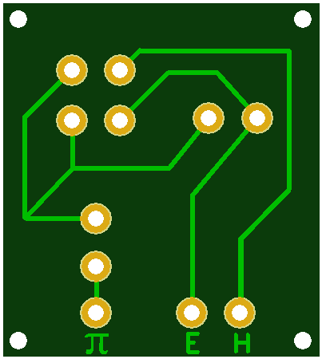
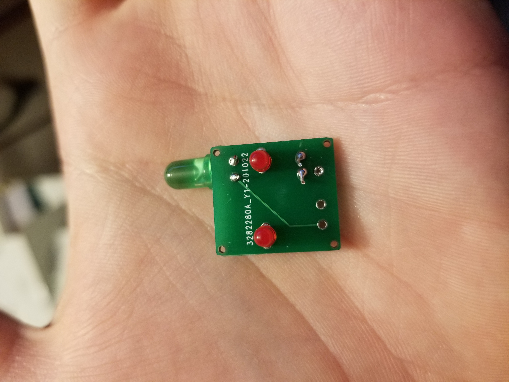
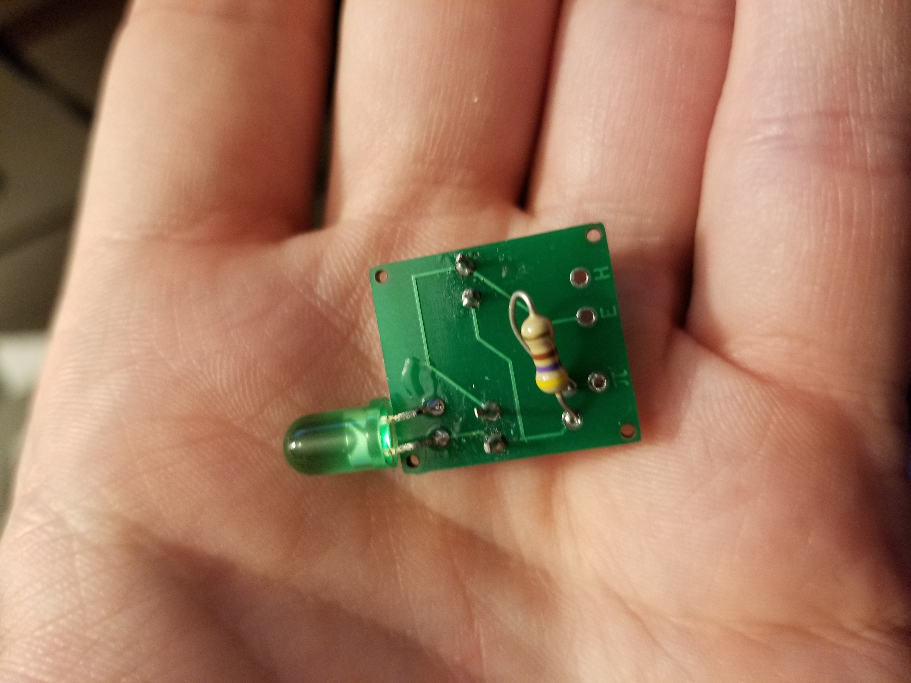

#### Botty's Face PCB files
This directory contains the gerber files made on https://easyeda.com/ 
and ordered from https://jlcpcb.com/ using these files you can solder together a face for Botty. 

Botty is wired up so that his head lamp is always on and that his eyes blink when a command
is being processed.

The Traces are for the following
* H - Botty's head lamp LED from Pi Zero's GPIO 23 pin
* E - Botty's eyes from Pi Zeros GPIO 22 pin
* π - Connects ground to the Pi Zero's ground

#### Wired up

